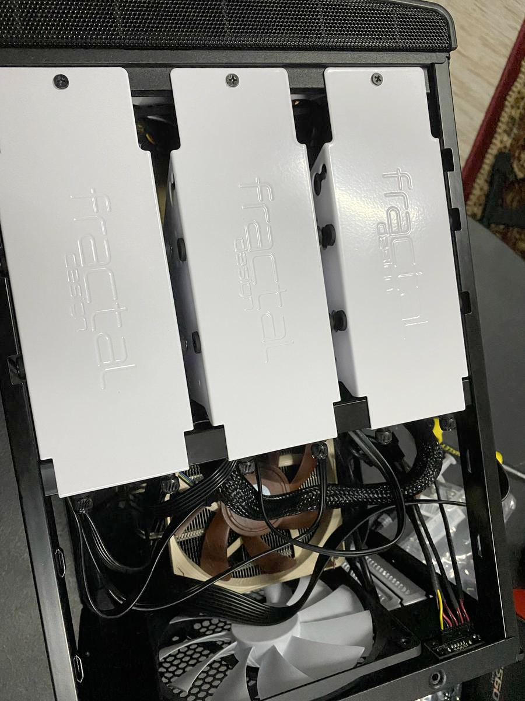

## What for?
You know what. I don't know. I just want to hoard data and have my own media server.

## Okay, what do?
Well, this is actually not simple. I've decided right out of the gate that I wanted to build it myself.
I'm not a stranger to a media server or a NAS before. If you could call a Raspberry Pi with a 16gB SD card
a NAS. I also want something that _for the most part_ I can plug and play, have high availability, flexible
for updates, and can generally take care of itself. 

In the NAS world these two things are generally antithetical of each other. Good rules of thumb here are if you
want to build it yourself, you can save money _but_ you'd have to do a lot of legwork. Likewise, if you buy
pre-built, you get access to their ecosystem (OS, parts) and is generally plug and play. Furthermore, dollar
for dollar you get more with building it yourself (as it is with PC building in general).

So, since I decided that I will be building it myself, Synology and Qnap (two of the most popular pre-built NAS vendors) are out.

Which means I need to decide on two things: the OS and parts.

### Unraid OS
When I first heard of Unraid I was immediately dismayed. It's not open source and it's not cheap. Given
that the servers I manage professionally at work are all open source, this is a pill that's very hard to swallow.

However, Unraid offers a _lot_ for what it is that is simply a dealbreaker in other OSs for me.

1. It's on Debian
This is a no-brainer. Debian-based OS are some of the easiest servers to use and maintain. This is also
what I'm most familiar with.
 
2. Docker as a first-class citizen
At this point I'm nearly sold to be honest. When I first experimented with the Raspberry Pi NAS,
I've been using Docker containers to manage various services. The ease-of-use just trumps every
other possible application hosting there is. I didn't want to deal with having to set up Docker
via a hack in other OSs. Especially if it's FreeBSD like TrueNAS.
 
3. You can use mismatched drives! 
And here it is. The most important part. Unraid uses a [parity system](https://wiki.Unraid.net/Parity)
to protect our drives. This is different from using traditional RAID systems that require you to have all your
drives at once or all in the same size upfront. For someone just starting out using a proper NAS,
the cost-entry to get say, six 20 tB drives at once is just not feasible. 

And so, Unraid it is.

### Parts

Now on to parts. For a TL;DR here's my [pcpartpicker link](https://pcpartpicker.com/b/Td4nTW).

Due to availability issues, I had to make tradeoffs for this build. Let's go one by one.

1. CPU - [Intel Core i3 10100](https://pcpartpicker.com/product/qtqBD3/intel-core-i3-10100-36-ghz-quad-core-processor-bx8070110100)
The only reason I went with Intel is that the 10100 is known as the king of energy efficient CPUs for NAS
(as far as I read. YMMV.) and that it supports [Quick Sync](https://www.intel.com/content/www/us/en/architecture-and-technology/quick-sync-video/quick-sync-video-general.html)
aka Intel's tech for CPU transcoding that supposedly makes it better. I wouldn't know since I don't plan to
transcode, but it's nice to have.
 
2. Motherboard - [Asus ROG Strix B60-I Gaming WIFI](https://rog.asus.com/ph/motherboards/rog-strix/rog-strix-b560-i-gaming-wifi-model/) 
Now this is the tradeoff. Unfortunately ITX motherboards are unicorns in this day and age 
of gamers' market that craves the biggest and most obnoxious cases out there. I had no choice
but to get this expensive (and gaming) motherboard that is compatible with my CPU. To be fair, I could've gotten
an mATX one, but I actually bought the CPU case first, which is amazing by the way, so there you go.

3. CPU Cooler - [Noctua NH-L12S](https://pcpartpicker.com/product/hbnG3C/noctua-nh-l12s-5544-cfm-cpu-cooler-nh-l12s)
One more goal for this build is to have an ultra-quiet NAS. We're talking drives spinning and files copying quiet.
What better way to achieve that than with a Noctua cooler? I actually tried putting my ear next to it while it's running,
and I swear I couldn't tell it was on. Don't do this at home though. My finger got caught in the spinning blade.

4. RAM - [G.Skill Ripjaws V Series 16 GB](https://pcpartpicker.com/product/Cf98TW/gskill-ripjaws-v-series-16-gb-2-x-8-gb-ddr4-3200-cl16-memory-f4-3200c16d-16gvkb)
Unraid actually boots off of a flash drive. Yes, you read that right. It doesn't boot off of an SSD. After it boots,
all data needed to maintain the OS's running state is transferred in RAM. Even with that though, Unraid isn't
as memory hungry as TrueNAS. My utilization sits at 20%.

5. Power Supply - [SeaSonic FOCUS Plus Gold 550 W](https://pcpartpicker.com/product/bkp323/seasonic-focus-plus-gold-550w-80-gold-certified-fully-modular-atx-power-supply-ssr-550fx)
Apparently this line of power supplies are popular among NAS users. But go ahead and get what you need. 

6. Storage. Ah, now this is where it starts to get interesting.
 
This is the highlight of NASs. As such we need to be very careful in choosing. To start with, I went with a [Samsung 970 Evo Plus 500 GB](https://pcpartpicker.com/product/TwWfrH/samsung-970-evo-plus-500-gb-m2-2280-nvme-solid-state-drive-mz-v7s500bam)
for my SSD cache. As a quick refresher, Unraid features the use of cache pools. Basically storage
that's supposed to be fast (faster than a hard drive at least) to store all your services (read: Docker containers)
and handle intensive I/O operations. By default, Unraid then runs a "mover" daily that moves extra
data present in the cache drive to the array of hard drives that are protected by parity.

To that purpose, I've chosen two [Western Digital WD Red Plus 6 TB](https://pcpartpicker.com/product/Ld6p99/western-digital-wd-red-plus-6-tb-35-5400rpm-internal-hard-drive-wd60efzx)s
for my hard drives. One to serve as usable space and the other to serve as parity. Choosing this wasn't easy as Seagate does offer
a very compelling product as well plus WD didn't do itself a lot of favors when [SMR gate](https://www.storagereview.com/news/wd-responds-to-smr-gate)
happened. But what finally led me to WD was that I made sure to choose the Plus version to ensure that it's CMR 
and that it has a quieter operating noise than Ironwolves. To be sure however, I will be using Ironwolves
for when the time comes to expand my array.

7. Flash Drive. [Samsung 32 GB BAR Plus (Metal) USB 3.1 Flash Drive](https://pcpartpicker.com/product/vRHRsY/samsung-32gb-bar-plus-metal-usb-31-flash-drive-speed-up-to-200mbs)
Like I said, Unraid boots off of a flash drive and this just happens to be, allegedly, the [best flash drive for Unraid](https://www.youtube.com/watch?v=jjkaidlZmgs). 
So there.

8. Case. [Fractal Design Node 304](https://pcpartpicker.com/product/BWFPxr/fractal-design-case-fdcanode304bl)
Finally, the thing that ties these all off. A small form factor, ITX case that can handle **SIX** 3.5" hard
drives! In all my research I haven't found another ITX case that I can buy that has this capacity. Plus
it looks all nice and sleek. 

### Build
Now that we got the parts together. Time to build. Here's a montage
of my NAS build. 

Do note that this case does not support both a power and reset switch. It only has a power switch.
A two-lead power switch to be exact. **You insert this in the middle row of the block where either is supposed
to go.** There I saved you a few rebuilds and hours. I wish I had taken a photo of this, but I forgot
and you're a big boy now so you can figure it out.

<figure>
  
  <figcaption>
    Always, always test everything using the BIOS with just the essential parts ready, first.
    This has always plagued. Just plug in the, RAM, CPU, Cooler, Power Supply, and a display.
  </figcaption>
</figure>

This particular motherboard supports 11th and 10th Gen Intel CPUs and features two M.2 slots
for NVMe SSDs. **However, you must be using an 11th Gen Intel CPU to use the front slot (the one
with the built-in shield/cover)**. If you use a 10th Gen like I do, that slot will be disabled,
and you won't even see it pop up in the BIOS. You'd need to use the slot at the back of the 
motherboard. The box comes with an extra thermal pad. Use this between the case and the SSD
underneath the board. This is very important.

<figure>
  
  <figcaption>
    Since the Ripjaws are a bit too tall, I needed to use the high-profile configuration of the 
    Noctua cooler. This just means that I had to move the fan from underneath to up top. The front
    of the fan should face the heatsink. It will be quite obvious what the front and back of the fan are.
  </figcaption>
</figure>

Also, don't be alarmed if there's a persisting LED light in the motherboard. As long as it's only
one, and you're not using a graphics card like I am, it should be fine. The LED light just means
that the motherboard cannot detect a graphics card. 

<figure>
  
  <figcaption>
    The SATA power cable are usually chained together. It's absolutely safe to use one running
    cable to power multiple drives.
  </figcaption>
</figure>

<figure>
  
</figure>

When flashing the boot drive with Unraid, **make sure to check the "Allow boot from UEFI" checkbox**. There is
currently no way to allow legacy mode in this motherboard. 

And that's it for the build. I hope this has been helpful to you all. My next
post will be about media automation on this very NAS. If you have any questions,
just drop a comment, and I'll do my best to respond.

