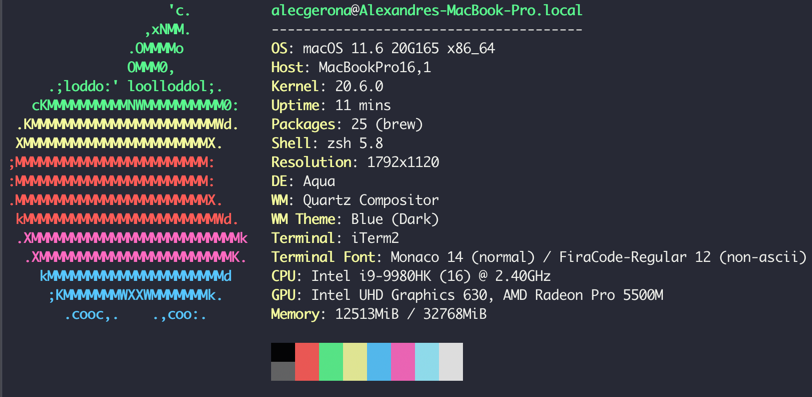

## Rationale
Gotta be honest. For the longest time, I've avoided the Apple ecosystem.
I'm still not that okay with it, but we have to try 'em all, right? 
What with [overheating MacBook Pros](https://forums.macrumors.com/threads/16-is-hot-noisy-with-an-external-monitor.2211747/page-173),
to class action lawsuits over [cracked M1 screens](https://9to5mac.com/2021/09/16/class-action-lawsuit-screen-cracks/), 
there remains a lot to be desired in the so-called walled garden.


## Setup
With that out of the way, this guide is how I set up my development environment on a
MacBook Pro 2019 16in the way I want it, so I'd have something to reference should I need
to do it all over again. Hope someone else finds it useful as well.


## 1. Xcode
Let's start simple by installing Apple's command line tools. Basically, things you need to
get any sort of development work on your machine. 

```shell
xcode-select --install
```

## 2. [iTerm2](https://iterm2.com/)
I believe it's already tradition by now (for developers at least) to immediately
replace macOS's default terminal with iTerm2.
Some would say it's a little bloated for what you use it for, but you're 
using a Mac already, so you shouldn't complain.


### Install
Installation is as simple as downloading the .dmg and installing through that.

### Key repeat rate
A severely underrated QoL change, this set up requires a restart after execution, but
you'd be able to glide on your keyboard once your key repeat rate is up. A boon
to Vim users, terminal junkies, and fast typists alike.

```shell
defaults write NSGlobalDomain KeyRepeat -int 1
defaults write NSGlobalDomain InitialKeyRepeat -int 10
defaults write NSGlobalDomain ApplePressAndHoldEnabled -bool false
```

### [Skin](https://iterm2colorschemes.com/)
For my terminal I'm using [iterm2-snazzy](https://raw.githubusercontent.com/sindresorhus/iterm2-snazzy/main/Snazzy.itermcolors).
Just download the page and import in iTerm2 (Preferences > Profiles > Colors > Color Presets > Import).



### [Hotkey summon](https://iterm2.com/documentation-hotkey.html)
Coming from [yakuake](https://github.com/KDE/yakuake) and [guake](https://github.com/Guake/guake), the ability
to summon the terminal from any desktop with just a hotkey is a godsend. Here's how to do it with iTerm2.

Go to Preferences > Keys > Hotkey > Create dedicated Hotkey window. This will create a dedicated profile
that iTerm2 will use when you summon it this way. You can then edit this profile as you wish.

My hotkey is ⌘+`

I set my transparency to 10% and window size to maximized.

### [Shell Integration](https://iterm2.com/documentation-shell-integration.html)
This is a utility that "keep track of your command history, current working directory, host name, and more—even over ssh."

This will be useful for the following feature of iTerm2.

### SSH workflow
Traditionally, we SSH to other machines by writing the full command such as `ssh user@host`. We then learn
to alias this by using the `.ssh/config` file and writing `ssh alias` instead. We can go much further in
iTerm2 by not even needing to type anything. Simply make a profile and make it run the ssh command you
need. 

For my setup I still prefer working mostly in my keyboard and having to open the profile from
the tab is just extra overhead that I want to avoid. That said, there is still an advantage 
to using profiles and that is to visibly notify you that you are working on a different terminal 
by either having a [badge](https://iterm2.com/documentation-badges.html) or a different theme or both.

For production terminals I use the [red alert](https://raw.githubusercontent.com/mbadolato/iTerm2-Color-Schemes/master/schemes/Red%20Alert.itermcolors) theme.
I also use the instance name as its badge. 

Finally, since I prefer having to type the ssh command myself, I have to set the profile up so it
would switch profiles once it detects that I've changed hosts. To do that, we need to implement
[Automatic Profile Switching](https://iterm2.com/documentation-automatic-profile-switching.html).

This iTerm2 feature requires Shell Integration which we did above. We then need to add
the expected user/host entry iTerm2 needs to switch profiles. 

It'll be something like this. It should end in a glob (*) or it won't work.

```
user@host*
```

## 3. [Homebrew](https://brew.sh)
Now that we have our initial cli tools and a spiffy terminal emulator to work in,
we need one more tool to be fully integrated in the macOS (sorta open source) ecosystem—homebrew,
the package manager that, like most things in a Pro Apple product, never had built in.

```shell
/bin/bash -c "$(curl -fsSL https://raw.githubusercontent.com/Homebrew/install/HEAD/install.sh)"
```

Afterwards you get access to package manager staples such as `brew install <package-name` 
among others.

## 4. [ZSH](https://en.wikipedia.org/wiki/Z_shell)
zsh is the default (and better) shell in macOS.
Aside from its [benefits over bash](https://medium.com/@harrison.miller13_28580/bash-vs-z-shell-a-tale-of-two-command-line-shells-c65bb66e4658),
we'd be making it even better with some choice improvements.


### [spaceship-prompt](https://spaceship-prompt.sh/)
Before anything else, we need to de-clutter our terminal prompt. What better way to do so than by installing
spaceship? 

```shell
brew install spaceship
```

This provides a minimalist yet information-filled prompt that changes with your context.
<figure>
  
  <figcaption>Credit: spaceship-prompt README.md</figcaption>
</figure>

Make sure that your iTerm2's font has an alternative option for non-Ascii characters since
Monaco (Apple's default) does not support powerline characters that spaceship needs. I chose
to go with [Fira code](https://github.com/tonsky/FiraCode). Just download and install.


### [zsh-autosuggest](https://github.com/zsh-users/zsh-autosuggestions)
Wouldn't it be great if we had autosuggest? This may be the single most useful plugin for zsh. If you'd only install
one plugin for zsh, this should be it. This allows zsh to suggest commands as you type them based
on your history.

Create a `~/.zshrc.local` if you haven't already. Since by default most general-purpose settings will be
in `.zshrc`, we'll be using the local file for our own custom settings. Let's also create a `~/.zsh` directory.
This is where zsh plugins are commonly installed by default. I prefer manually installing plugins manually
(as opposed to using zsh managers such as Oh My Zsh since I think it's easier to maintain that way) so
we're gonna clone the autosuggest repository ourselves.

```shell
git clone https://github.com/zsh-users/zsh-autosuggestions ~/.zsh
```

Then add the following line to the top of your `.zshrc.local` file. 
```shell
source ~/.zsh/zsh-autosuggestions/zsh-autosuggestions.zsh
```

Restart your terminal for it to take effect.

### [zsh-syntax-highlighting](https://github.com/zsh-users/zsh-syntax-highlighting)
Next is syntax highlighting. A minor QoL sure, but still important for those long-winded command strings.

Installation is pretty much similar.

```shell
git clone https://github.com/zsh-users/zsh-syntax-highlighting ~/.zsh
```

Add the following line near the top of your `.zshrc.local`.
```shell
source ~/.zsh/zsh-syntax-highlighting/zsh-syntax-highlighting.zsh
```

As usual, restart your terminal for it to take effect.

### Vim mode+
Since I'm a Vim user (and disciple, please use Vim), I tend to want to use Vim everywhere I can get it to work.
And that means here in the terminal. 

Add these in `.zshrc.local`
```shell
##### Enable zsh vim mode
bindkey -v

##### Change cursor shape for different vi modes.
function zle-keymap-select {
  if [[ ${KEYMAP} == vicmd ]] ||
     [[ $1 = 'block' ]]; then
    echo -ne '\e[1 q'
  elif [[ ${KEYMAP} == main ]] ||
       [[ ${KEYMAP} == viins ]] ||
       [[ ${KEYMAP} = '' ]] ||
       [[ $1 = 'beam' ]]; then
    echo -ne '\e[5 q'
  fi
}
zle -N zle-keymap-select
zle-line-init() {
    zle -K viins # initiate `vi insert` as keymap (can be removed if `bindkey -V` has been set elsewhere)
    echo -ne "\e[5 q"
}
zle -N zle-line-init
echo -ne '\e[5 q' # Use beam shape cursor on startup.
preexec() { echo -ne '\e[5 q' ;} # Use beam shape cursor for each new prompt.

##### Use vim keys traversing history the smart way:
autoload -U history-search-end
zle -N history-beginning-search-backward-end history-search-end
zle -N history-beginning-search-forward-end history-search-end
bindkey "^[[A" history-beginning-search-backward-end
bindkey "^[[B" history-beginning-search-forward-end
bindkey -M vicmd 'k' history-beginning-search-backward-end
bindkey -M vicmd 'j' history-beginning-search-forward-end
```

A bit of a mouthful I know but bear with me.

As commented, these changes allow you to use Vim in the terminal, change the cursor shape
in your terminal as you switch modes, and finally (a personal favorite) allow the down(j) and up(k) keys on Vim
to search your history based on your already typed command!

This means that if you typed `git` and went to command mode and pressed `k`, this will show the previous
command you started with `git` as well! Personally I use this feature just about every day.

Again, restart your terminal for the changes to take effect.

### [fzf](https://github.com/junegunn/fzf)
We're still not done with shell goodness with `fzf` or fuzzy finder. This little tool allows you
to zip around your terminal whether you need to quickly change directories or open a file you
simply couldn't remember the full path/name of. Just fuzzy find it!

First of, install it.

```shell
brew install fzf
```

This allows usage of the `fzf` cli command and enables a bunch of commands out of the gate.

`Ctrl + T` allows you to search for any file and selecting one returns it in your buffer.

`Alt + C` allows you to search for any directory and selecting one moves you to it.

These alone however are not enough to maximize your productivity with fzf. By default,
fzf uses [GNU find](https://man7.org/linux/man-pages/man1/find.1.html) to execute its searches.
Albeit well-featured, it's not fast. To effectively fuzzy find,
fzf will have to crawl over a lot of files to get you the most accurate match. To achieve this,
you need to give it a helping hand (or two).

First, use [ripgrep](https://github.com/BurntSushi/ripgrep). Arguably the fastest cli search tool
out there, this makes it the best default go-to command for fzf. To do this, simply
set the following environment variable in your `.zshrc.local`.

```shell
export FZF_DEFAULT_COMMAND='rg --files --hidden --follow -g "!{.git,node_modules}/*" 2> /dev/null'
export FZF_CTRL_T_COMMAND="$FZF_DEFAULT_COMMAND"
```

These let fzf know to use `rg` as its default search tool. Next is to exclude certain paths
from search. Basically paths where you know you won't deal with in the terminal yourself. Examples of
this are the `/Library` and `/Pictures` directories.

These come with macOS with its implementation
of iCloud and certain apps. If you don't exclude these, fzf will have to go through a _lot_ of files
to even get to the relevant ones (probably the one in your `~` directory). So if you do need
to access those files, skip this step.

Create a `.rgignore` file. Any files/directories in this file will be ignored by ripgrep.

Sample file:
```
/Library
/Pictures
```

More experienced users might note
that `rg` won't work for directories and you're right. This is well documented in [ripgrep#169](https://github.com/BurntSushi/ripgrep/issues/169)
and [ripgrep#388](https://github.com/BurntSushi/ripgrep/issues/388).

So if we can't use ripgrep and by default fzf's change directory feature is still using `find` that
doesn't ignore directories, we can't keep waiting for it to index all those files/directories all day now can we?

We can't. So we need another tool. Namely, [fd](https://github.com/sharkdp/fd). Touted as the simple
and more user-friendly alternative to `find`, fd has exactly the feature we need: an ignore file.

So much like before, we set the environment variable:

```shell
export FZF_ALT_C_COMMAND="fd --type d"
```

Then we create a `.fdignore` file that has the same contents as `.rgignore`. And we're done.

Okay we're halfway done. The following steps for this guide are specific to the tech stack
I commonly use. 

## 5. Node
As one of the most common developer tools, there are a lot of ways to install this.
My favorite is [nvm](https://github.com/nvm-sh/nvm). This allows you to have multiple node versions
in your machine and can easily switch between them with just a simple command.

Let's get started.

```shell
curl -o- https://raw.githubusercontent.com/nvm-sh/nvm/v0.38.0/install.sh | bash
```

Afterwards, make sure the following snippet is in your `.zshrc` file.

```shell
export NVM_DIR="$([ -z "${XDG_CONFIG_HOME-}" ] && printf %s "${HOME}/.nvm" || printf %s "${XDG_CONFIG_HOME}/nvm")"
[ -s "$NVM_DIR/nvm.sh" ] && \. "$NVM_DIR/nvm.sh" # This loads nvm
```

Restart your terminal and execute `command -v nvm`. This should output "nvm" to tell you it's working.

Running `nvm install node` will install the latest version and set it as your default Node version.

## 6. Python
macOS should already come packaged with Python by default. But any Python dev can tell you
that it's a bad idea to have all of your projects depend on a single version of Python, let alone
the system-installed one. 

So how do we fix this? We use a tool much like nvm—[pyenv](https://github.com/pyenv/pyenv).

```shell
brew install pyenv pyenv-virtualenv
```

Make sure that the following line is in your `.zshrc`.

```shell
eval "$(pyenv init -)"
```

Restart your terminal and pyenv should be working.

### Usage
Start with setting the default python version you want to use (which is not the system-installed one).

```shell
##### As of the time of writing, this is the latest I want my system python to run on
pyenv install 3.9.7
pyenv global 3.9.7
```

Running `python` in your terminal should use the version you've set as global.

Now say you've got a project that runs on Python 3.8.12 that as the experienced Python
developer that you are, need to use a virtualenv on? 

```shell
##### Install the needed Python version first
pyenv install 3.8.12 # 1
cd my-python-project # 2
pyenv virtualenv 3.8.12 my-python-project # 3
pyenv local my-python-project # 4
```

So what exactly happens after you run these series of commands? 1 and 2 are pretty self-explanatory.
3 just creates the virtualenv with the name you specified (by convention it shares the name of the project) This
is possible since we installed `pyenv-virtualenv` along with `pyenv` using Homebrew.
And 4 creates a `.python-version` file that has the name of the virtualenv you want to be activated as
soon as you `cd` into that directory. Neat, huh?

## 8. Docker
Last, but not least, is Docker. Thankfully this is the easiest to install as it's literally just going
to [Docker for Desktop's website](https://www.docker.com/products/docker-desktop) and just downloading
and installing. Once it's good to go it gives you a UI that is sort of [Portainer](https://www.portainer.io/)-lite
that has brief information regarding the logged in Docker user, running containers, and downloaded images. 

Along with this of course is the Docker runtime that lets you run the `docker` command on your
terminal.

And with that, we finally come to the end of this so-called 12-minute read which took anything but to write.
I hope this helps you and my future self in setting up your development environment, be it in macOS or Linux, 
the way you want it.

As long as it uses Vim, you're cool.
