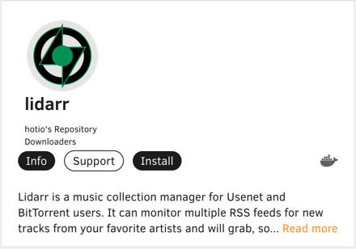
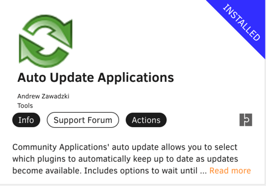

## So what exactly do I mean by media automation?
So the plan is simple: have my NAS serve all my media. But where will the media come from? How will they
be managed internally in its folders? Drives? What can I use to manage this and most importantly automate
it?

## What to do
So if you haven't seen my [previous post](https://alecgerona.io/building-my-nas), I'm using Unraid as my NAS OS. Just a way to keep management
overhead to a minimum. This also means that it'll also manage my Docker installation for me which I intend
to use to run all the parts that constitutes my media automation strategy.

So without further ado, let's go step by step.

### 0. Prerequisites
Before proceeding with this guide be aware that you should have a working knowledge of Linux
filesystems, Docker, media servers, torrents, and usenet to maximize the features. If you're
at all confused by any of this (as was I when I started) feel free to leave a comment and I'll
help out when I can.

### 1. qBittorrent

Of course the start is qBittorrent ( ͡° ͜ʖ ͡°). I chose to go with [hotio's qBittorrent image](https://hotio.dev/containers/qbittorrent/)
since it has more features (such as having Vuetorrent pre-installed) than say, Linuxserver.io's which I have 
used in the past. Unraid allows this via a simple install command in the apps tab assuming you've installed Unraid's
Community Applications OS plugin.


Remember to toggle autostart to start the containers on reboot.

And here are the settings that I used. The `/data/torrents` in the container path is where
we will have qBittorrent direct its downloads.

Also, **very important**, make sure to use a custom docker network for this one (and all
the succeeding containers following except otherwise noted). This serves a lot of purposes
but the most important part is that our containers will be limited to their own network
and that they can connect to each other using their own names instead of IP. This is
critical for when you're moving servers, restoring a backup, or changing your server's static
IP.

In case you forgot how to create a custom docker network it's as simple as going into the terminal of
your Unraid server and:

```shell
docker network create <your-network-name>
```


Then once in the web UI, we have qBittorrent use the path we've specified in the
step above.


Then we change our default admin password and enable VueTorrent web UI.


Now before we hit save, restart the UI, and see that sexy VueTorrent skin, a quick reminder to disable these two settings right here.
This will be a needed way down the line. Of course this is optional as is the later step but if 
you're not planning to open up your NAS to the internet then this really isn't
a security issue.


That should be it for our downloader.

### 2. Sonarr
Next up is Sonarr or the TV show downloader. I'm also using Hotio's just by virtue
of already using the previous one with it.


We pretty much set up the same settings on its mapping. **Except** that instead
of mapping the container path to a specific host directory or share, we're giving
it access to the entire Unraid `/data` share. This is so that Sonarr has access
to all the subdirectories within that share and can move files between torrents/usenets
to media and other subdirectories we may have via hardlinking or instant-move.


Now in Sonarr's web UI, go to Settings > Media Management and map our `/data/media/tv` as a root folder.


Some things to note here is that the disk space that Sonarr shows might be incorrect since
it may be showing the [container's disk space instead](https://wiki.servarr.com/sonarr/system#disk-space).
So don't worry about it. Also, you might notice that there are a few issues listed in the Systems tab.
This is normal. This is just telling us that we need to do to make Sonarr fully operational.

### 3. Jackett
Which brings us to our next requirement, Jackett. Now, Jackett is what is called an indexer or basically
the tool that searches in behalf Sonarr and the other Arrs on where they might find their files to download.
No need to change anything in the mapping so this is a straight install.

Now onto the web UI, click Add indexers and add the indexers that you might want to use.
For security's sake, I won't put up a screenshot here. You should know it when you see it.

Back to Sonarr, go to Settings > Indexers and add a Torznab feed. Here you just
add the name of the indexer itself, the Torznab feed URL and the API key from Jackett.

I also added a few more settings to my preferences in the categories.


You need to repeat this for each indexer you've added in Jackett.

Next is to add qBittorrent to Sonarr. Go to Settings > Download Clients.
There should be a qBittorrent preset. Note here that the host is now the qBittorrent container's name instead
of its ip/port! This is because they're all in the same Docker network.


Then make sure the prefilled category, `tv-sonarr`, is in qBittorrent itself.


### Progress Check
Okay, okay. I know that was long. But those were mostly images. So not really. Just a quick recap,
but at this point we've actually automated everything from looking up a series to having it downloaded
to our array. Really. In Sonarr, try going to Series > Add New, look up any series you want, and hit Add. If you
tick the `Start search for missing episodes` box, it'll actually search and then download the episodes for you.
Yes. Every episode of every season.

And we're just getting started.

### 4. TV Show Download Preferences
Now this part is mostly for my benefit (as this guide really is), but feel free to copy them.

### 4.1. Set seeding limit time
First, head to qBittorrent to set the seeding limit time to 120 minutes. This will remove the torrent
from qBittorrent after the specified time.


### 4.2. Create a Sonarr HD+ Quality Profile
Sonarr by default comes with a lot of Quality profiles. These work well the default qualities you
would find out there such as 720p, 1080p, 4k, and so on. This profile is just a quick QoL way
to tell Sonarr to prefer the latest and greatest quality (4k with niceties such as Dolby or Remux) all
the way down to 1080p. Sonarr will then flag an error if it can't find beyond that.

You should then select a profile per series accordingly.


### 5. Radarr
The next Arr for movies.


We know the drill by now, so I'll just post screenshots for posterity.

Set the root folder.


Set the indexers.

Add your qBittorrent download client.


Make sure qBittorrent has the required category.


### 5.1. (Optional) Radarr Profiles and Custom Formats
Now we're gonna pull off a pro-gamer move and make Radarr picky. Now as you may know,
there's a _lot_ possible group/encoding/quality for releases. Some are better
than others. Some should never be downloaded at all. Now here's my preferences.
I mostly prefer 4k releases packaged by Tigole/QxR with x265 or HEVC encoding and AAC audio. This ensures
a very reasonable file size with great picture and audio quality. Perfect type to hoard. 

Of course not every release will be like this, so we need to tell Radarr to "score" releases
according to our specifications and just grab whichever scores the highest (the one that fits our criteria the most).

First, go to Profiles and again create an HD+ profile. 


As you can see, there's a section below called Custom Formats along with the criteria I listed above.
Next to the labels are the points assigned to them. Let's create them now.

Go to Settings > Custom Formats > Add Custom Format and hit Import.

Paste the following. 

```json
{
  "name": "x265",
  "includeCustomFormatWhenRenaming": false,
  "specifications": [
    {
      "name": "x265",
      "implementation": "ReleaseTitleSpecification",
      "negate": false,
      "required": true,
      "fields": {
        "value": "[xh][ .]?265|\\bHEVC(\\b|\\d)"
      }
    },
    {
      "name": "Remux",
      "implementation": "QualityModifierSpecification",
      "negate": true,
      "required": true,
      "fields": {
        "value": 5
      }
    }
  ]
}
```

Hit save and add one more.

```json
{
  "name": "Preferred Groups",
  "includeCustomFormatWhenRenaming": false,
  "specifications": [
    {
      "name": "Preferred Groups",
      "implementation": "ReleaseTitleSpecification",
      "negate": false,
      "required": true,
      "fields": {
        "value": "\\b(Tigole|qxr|QxR|tigole)\\b"
      }
    }
  ]
}
```

Now these may look complicated but they're simply just JSON text that has a
regex as their value to provide the rules to Radarr. 

That's it, actually. Now when we try to add a movie and hit search files manually,
we can see the scores that Radarr has given to each release and prioritized them accordingly.


Now just as a footnote if you're gonna play with this around some more: Radarr will
always prioritize quality over whatever score a release may have been given. Meaning,
if you have a release that has a higher quality than what matched your criteria, 
Radarr will choose that. Check out Radarr's [complete priority list](https://trash-guides.info/Radarr/Radarr-setup-custom-formats/#radarr-current-logic).

### 6. (Optional) Bazarr
**Note**: This is only required if you're going to use a media server that does not
already fetch subtitles. Since I'll be using Plex, I can skip this.

Since we're done with our optical media, it's time to subtitle them. 


Now go open Bazarr's web ui, go to Settings > Sonarr and tick Enabled. Input these settings.
You can get Sonarr's API key in Sonarr's Settings > General > Security. Hit Test to validate.


Now we add a Language Profile. We will set this profile to be applied to all incoming TV Shows and Movies.


Next we add our subtitle provider. Go to Settings > Providers. Do create an account first.


Now Bazarr will automatically download English subtitles to our media and place it alongside the files.

### 7. Lidarr
Our final Arr, for our aural media.



Much like Sonarr and Radarr, let's use the same settings.

Set the root folder.


Set the indexers.

Add your qBittorrent download client.


Make sure qBittorrent has the required category.


### Progress Check
Time for another one. Now I know we've really done a lot now. We're now able to automatically procure
media of all types. What's left is a way to consume them.

### 8. Plex
Arguably the reason for most NASs, Plex turns your collection into Netflix.

Now I know we've been using Hotio's images for a while but for this one, since I'm planning to buy
Plex Pass, which is the pro version of this, and I was an idiot that didn't use the 
correct network type and incorrectly blamed Hotio's image for Plex not working, I 
went with the official Plex Media Server image.


The config now has more fields. Primarily because of more volumes to map. Nothing
complicated, however. One thing we need to do though is to generate our claim key.
This assigns our Plex account to our NAS. Go to https://plex.tv/claim to log in
and generate one.

**Note**: Set the Network Type to **Host**. This container is the only exception.


Now let's go to Plex web UI and configure our server. Add a name and all our
media libraries.


Et voila. We now have a fully functioning media aggregator in our server. This is accessible
by any native Plex apps your devices can install (Android, iOS, Smart TV, etc.).

Now let's set a few more details for Plex. Starting with subtitles. Go to Settings >
Your Server > Agents. Create an account in opensubtitles.org and use your credentials
in this field. Rearrange the Local Media Assets tab to be the highest. This is so that
if you ever use Bazarr or would like to use your own metadata for a specific entry then Plex
will use that over whatever it has downloaded on its own. 


Do the same for TV shows.


Next, go to Settings > Your Server > Library. Check the following boxes pertaining
to Library sync. This makes sure that Plex's libraries will reflect whatever you've 
downloaded or moved to your media folders.


### 9. Organizr
At this point you may be tired of either memorizing ports, bookmarking the different web UIs or just plain typing
them out all the time in your browser to visit each. I know I was. So there's a better way. There always is. 


After installation, just add tabs like below:


This is where the settings for disabling those things such as clickjacking come to play. This enables us to view 
our web UIs in iframes, so we never have to open another tab to view another web UI. Well, except Jackett. I haven't
been able to view that as an iframe yet. I didn't bother because you never have to view it anyway. 

### 10. Spring Cleaning
Now all that's left is to make sure that our server is all tidy
and properly backed up. Luckily, Unraid already has plugins for them. 

### 10.1. Appdata Backup
First up is backing up our containers' data. A lot of people gloss over this but with
all the effort we spent painstakingly setting up our containers we should get this
backed up properly, so we won't have to do it again should our cache drive (where our
appdata lives) fail.


Let's start configuring by creating the share we want our backups to go.


Then schedule the backup. Since I won't be adding/configuring docker containers all that much,
weekly is fine. Remember that this backup will turn off all your containers when it's running. This
may or may not affect the daily mover task. I prefer to keep just one daily scheduled task in my headspace.


### 10.2 Appdata Auto Update
Next is to schedule the updates of our plugins and Docker containers. Luckily,
this works hand in hand with Appdata Backup.

Simply install:



Configure (do the same for Docker):


And toggle the Update Applications On Restart? checkbox in Appdata Backup.


### 11. Trakt
Last but not least, we need a way to discover movies and shows to add to our collection. Plex
does not offer this and Radarr and Sonarr are quite primitive at this, too. This is where Trakt shines.

Trakt is a service to track your media consumption not just in Plex, but in every streaming service
out there such as Netflix and Disney+. 

**Note**: The following instructions are just a unidirectional sync of Trakt and Plex as you need a
Plex Pass for bidirectional syncing. The sync is not even for Plex per se but more for Radarr and Sonarr
to tell it what to add and download.

Begin by creating an account in https://trakt.tv

Then head over to Radarr > Settings > Lists > Add List > Trakt List > Trakt User.
In here I'll be tracking my Watchlist public list. This is a list that every Trakt user
gets by default. You can copy this or create your own list.


Same with Sonarr. Settings > Import Lists > Trakt User.


And that's it. Soon as you add media into your Trakt watchlist be it using the web app
or the iOS companion app, Sonarr and Radarr will add it. 

### Conclusion
And we're finally done. I'm planning to add more posts regarding my Unraid journey and possibly
trying my hand in making automation tools of my own. Again, if you have any questions don't
hesitate to drop me a line or a comment down below, and I'll do my best to respond and help.

Here's to hoping future me can read this and find this useful.


